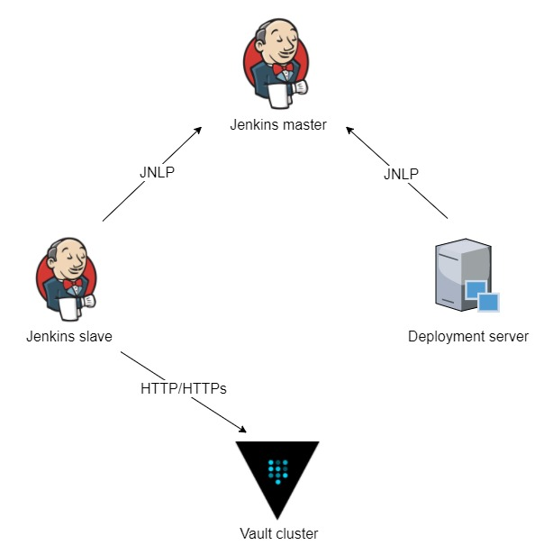
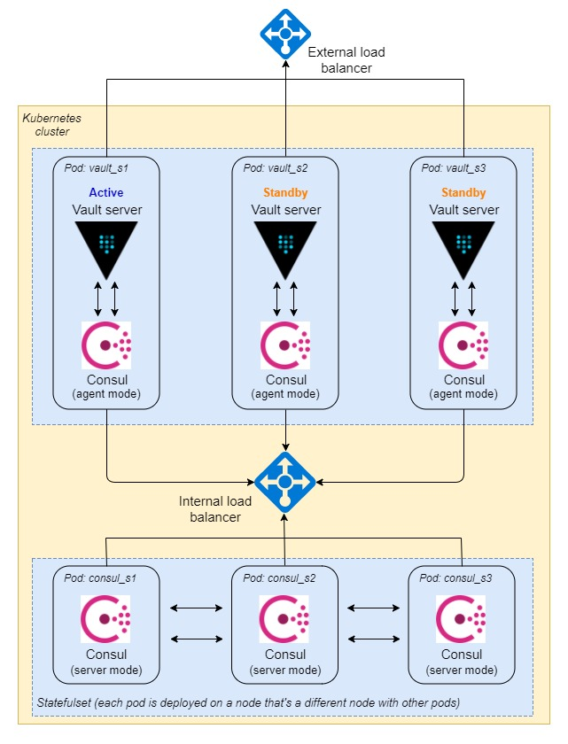

# Secret Management solution with Hashicorp Vault and Consul on Kubernetes
The Jenkins credential store in most enterprises is becoming a potential attack vector. It’s generally filled with long lived credentials, sometimes even to production systems.   
In comes Hashicorp’s Vault, a solution that enables the secure store of secrets, and dynamic generation of credentials for your job. Look the overview picture below, it certaintly looks promising.

### Overview

1. Jenkins master triggers a new build and provisions a slave on k8s cluster
2. Provisioned slave pulls source code from SCM, does necessary steps to build software packages and push to Artifactory if needed
3. The slave authenticates to Vault and gets required secrets that need for deployment steps
4. Deployment server gets software packages from Jenkins master or Artifactory and secrets. Doing necessary steps to deploy application

### Deployment topology

Consul pods function in this deployment is to serve as the storage backend for Vault. This means that all content stored for persistence in Vault is encrypted by Vault, and written to the storage backend at rest.

Please refer [consul/README.md](consul/README.md) for deploying Consul cluster and [vault/README.md](vault/README.md) for deploying Vault cluster on Kubernetes.   
In additional, you can refer [Vault Reference Architecture](https://learn.hashicorp.com/vault/operations/ops-reference-architecture) for more details.

### Vault ACL strategy
The picture below will help you have quick look on Vault ACL strategy. Please refer [vault-policies/README.md](vault-policies/README.md) for details.   

