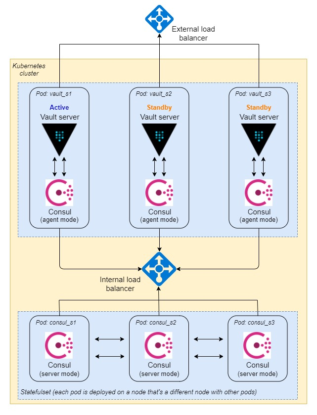

### Overview

1. Jenkins master triggers a new build and provisions a slave
2. Provisioned slave pulls source code from SCM, does necessary steps to build software packages and push to Artifactory if needed
3. The slave authenticates to Vault and gets required secrets that need for deployment steps
4. Deployment server gets software packages from Jenkins master or Artifactory and secrets. Doing necessary steps to deploy application
### Deployment Architecture

### Vault ACL strategy

