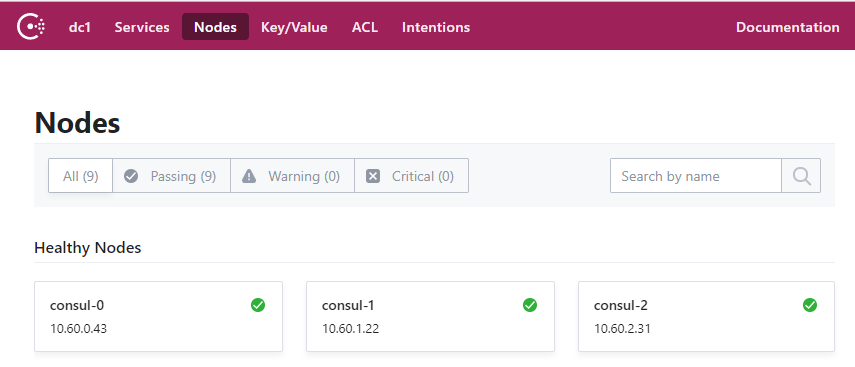

## Deploy Consul cluster on Kubernetes
This guide will walk you through deploying a three (3) nodes Consul cluster on Kubernetes.
### Create the Consul Secret and Configmap
The Consul cluster will be configured using a combination of CLI flags, and a configuration file, which reference Kubernetes configmaps and secrets.   
Store the Consul server configuration file in a ConfigMap:
```bash
kubectl create configmap consul --from-file=config/server.json
```
Store the gossip encryption key in a Secret:
```bash
kubectl apply -f secret.yaml
```
### Create the Consul Service
```bash
kubectl apply -f service.yaml
```
### Create the Consul Service Account and Cluster Role
```bash
kubectl apply -f service-account.yaml
kubectl apply -f cluster-role.yaml
```
### Create the Consul StatefulSet
```bash
kubectl apply -f statefulset.yaml
```
Verify each member is Running before moving to the next step.
```bash
$ kubectl get pods
NAME                             READY   STATUS        RESTARTS   AGE
consul-0                         1/1     Running       0          1m
consul-1                         1/1     Running       0          1m
consul-2                         1/1     Running       0          1m
```
### Verification
At this point the Consul cluster has been bootstrapped and is ready for operation.  
To verify things are working correctly, review the logs for one of the cluster members.
```bash
$ kubectl logs consul-0
bootstrap_expect > 0: expecting 3 servers
==> Starting Consul agent...
==> Consul agent running!
           Version: 'v1.4.4'
           Node ID: '9f9846c7-e4f6-9fd2-5f24-3ac946cea8f3'
         Node name: 'consul-0'
        Datacenter: 'dc1' (Segment: '<all>')
            Server: true (Bootstrap: false)
       Client Addr: [0.0.0.0] (HTTP: 8500, HTTPS: -1, gRPC: -1, DNS: 8600)
      Cluster Addr: 10.60.0.43 (LAN: 8301, WAN: 8302)
           Encrypt: Gossip: true, TLS-Outgoing: false, TLS-Incoming: false
```
The consul CLI can also be used to check the health of the cluster.
```bash
$ kubectl exec -it consul-0 sh
$ consul members
Node                    Address          Status  Type    Build  Protocol  DC   Segment
consul-0                10.60.0.43:8301  alive   server  1.4.4  2         dc1  <all>
consul-1                10.60.1.22:8301  alive   server  1.4.4  2         dc1  <all>
consul-2                10.60.2.31:8301  alive   server  1.4.4  2         dc1  <all>
```
### Accessing the Web UI
The Consul UI does not support any form of authentication out of the box so it should not be exposed. To access the web UI, start a port-forward session to the consul-0 Pod in a new terminal.
```bash
kubectl port-forward consul-0 8500:8500
```
Visit http://127.0.0.1:8500 in your web browser.


### Clean up:
Delete statefulset and all PVC
```bash
kubectl delete -f statefulset.yaml
kubectl delete pvc data-consul-0 data-consul-1 data-consul-2
kubectl delete -f secret.yaml -f service.yaml -f service-account.yaml -f cluster-role.yaml
kubectl delete configmap consul
```
### Others
Update configmap when changing config file for consul
```bash
kubectl create configmap consul --from-file=config/server.json -o yaml --dry-run | kubectl replace -f -
````
