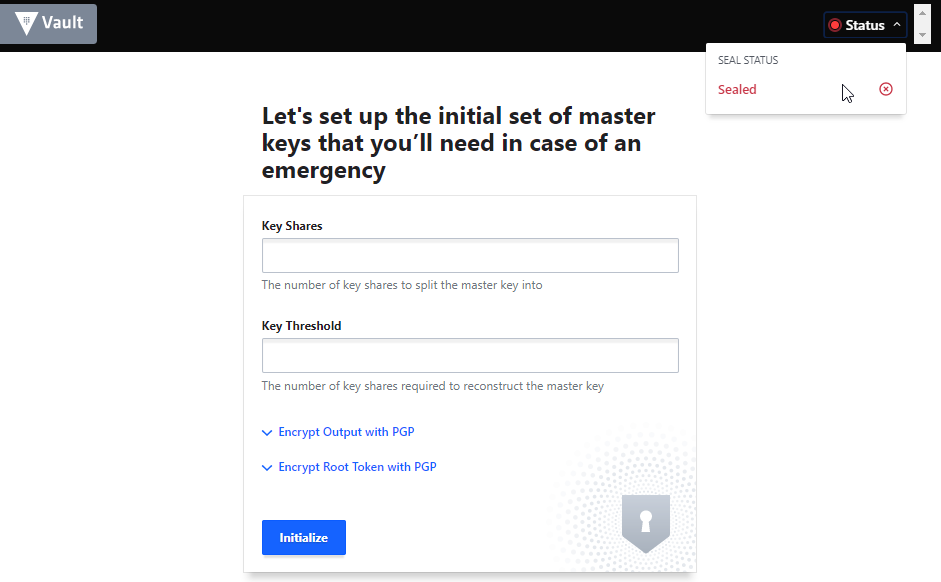
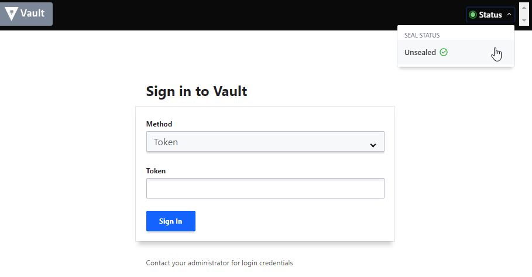

## Deploy Vault cluster on Kubernetes
This guide will walk you through deploying a three (3) nodes Vault cluster on Kubernetes.

### Create the Vault Configmap
```bash
kubectl create configmap vault --from-file=config/config.json
```

### Create the Vault Service
```bash
kubectl apply -f service.yaml
```

### Create the Vault Deployment
```bash
kubectl apply -f deployment
```
Verify each member is Running before moving to the next step.
```bash
$ kubectl get pods
NAME                              READY   STATUS    RESTARTS   AGE
vault-6b45b947f5-dvx67            2/2     Running   0          56s
vault-6b45b947f5-g8z7d            2/2     Running   0          56s
vault-6b45b947f5-w8cnl            2/2     Running   0          56s
```

### Init Vault
You need to install vault CLI on local machine first. Please refer [https://www.vaultproject.io/docs/install/](https://www.vaultproject.io/docs/install/)
```bash
$ export VAULT_ADDR=http[s]://<IP_OF_VAULT_SERVICE>
$ vault status
Key                Value
---                -----
Seal Type          shamir
Initialized        false
Sealed             true
Total Shares       0
Threshold          0
Unseal Progress    0/0
Unseal Nonce       n/a
Version            n/a
HA Enabled         true
```
Now let's init Vault:
```bash
$ vault operator init
vault operator init
Unseal Key 1: qyC0yBGC6L3YGFJFwwIEsbg4Ab/MkFSBmzCE7GDuXfWh
Unseal Key 2: V0WVz6imAsLKdByKSv/c/+izmWR1kufFxfMtup06Cvzu
Unseal Key 3: v0OM4IrPyBAtnnMtcu6xB1MzbT4G/7wYjwcPer52QQ+a
Unseal Key 4: 7YCaE655RHtjvJeIL18oqOBQlMnBG8qDmSj68rgwf62i
Unseal Key 5: DUelmGBeza2DqTh4q/L6pq4y6TdzFwLEEZ7ZgIpBpe7C

Initial Root Token: s.j4XrgAjdIePRgSZaGb6bMc4I

Vault initialized with 5 key shares and a key threshold of 3. Please securely
distribute the key shares printed above. When the Vault is re-sealed,
restarted, or stopped, you must supply at least 3 of these keys to unseal it
before it can start servicing requests.

Vault does not store the generated master key. Without at least 3 key to
reconstruct the master key, Vault will remain permanently sealed!

It is possible to generate new unseal keys, provided you have a quorum of
existing unseal keys shares. See "vault operator rekey" for more information.
```
Init operation is also performed on Web-UI:


### Unseal Vault cluster
Now, Vault pods need to be unsealed. Unsealing is a process of constructing the master key (which is constructed by Shamir’s secret sharing algorithms) to read decryption key to decrypt data.
```bash
$ kubectl get pods
NAME                              READY   STATUS    RESTARTS   AGE
vault-6b45b947f5-dvx67            2/2     Running   0          18m
vault-6b45b947f5-g8z7d            2/2     Running   0          18m
vault-6b45b947f5-w8cnl            2/2     Running   0          18m
$ kubectl port-forward vault-6b45b947f5-dvx67 8200:8200
Forwarding from 127.0.0.1:8200 -> 8200
Forwarding from [::1]:8200 -> 8200
```
Open a new terminal
```bash
$ export VAULT_ADDR=http://localhost:8200
$ vault operator unseal
Unseal Key (will be hidden): <one of unseal key in previous steps>
Key                Value
---                -----
Seal Type          shamir
Initialized        true
Sealed             true
Total Shares       5
Threshold          3
Unseal Progress    1/3
Unseal Nonce       a186ea08-5e69-8bdf-0327-1d22c6c3d6e0
Version            1.1.0
HA Enabled         true

$ vault operator unseal
Unseal Key (will be hidden): <one of unseal key in previous steps>
Key                Value
---                -----
Seal Type          shamir
Initialized        true
Sealed             true
Total Shares       5
Threshold          3
Unseal Progress    2/3
Unseal Nonce       a186ea08-5e69-8bdf-0327-1d22c6c3d6e0
Version            1.1.0
HA Enabled         true

$ vault operator unseal
Unseal Key (will be hidden): <one of unseal key in previous steps>
Key                    Value
---                    -----
Seal Type              shamir
Initialized            true
Sealed                 false
Total Shares           5
Threshold              3
Version                1.1.0
Cluster Name           vault-cluster-7e6102a9
Cluster ID             f7a1e289-778b-176d-09ed-7a9ce7cdce97
HA Enabled             true
HA Cluster             n/a
HA Mode                standby
Active Node Address    <none>
```
Doing those steps above for 2 remaning pods.   
Pod `vault-6b45b947f5-g8z7d`:
```bash
$ kubectl port-forward vault-6b45b947f5-g8z7d 8200:8200
Forwarding from 127.0.0.1:8200 -> 8200
Forwarding from [::1]:8200 -> 8200
```
```bash
$ vault operator unseal
Unseal Key (will be hidden):
Key                Value
---                -----
Seal Type          shamir
Initialized        true
Sealed             true
Total Shares       5
Threshold          3
Unseal Progress    1/3
Unseal Nonce       7cbd114e-9bbd-8e93-c98b-a33e972837a4
Version            1.1.0
HA Enabled         true

$ vault operator unseal
Unseal Key (will be hidden):
Key                Value
---                -----
Seal Type          shamir
Initialized        true
Sealed             true
Total Shares       5
Threshold          3
Unseal Progress    2/3
Unseal Nonce       7cbd114e-9bbd-8e93-c98b-a33e972837a4
Version            1.1.0
HA Enabled         true

$ vault operator unseal
Unseal Key (will be hidden):
Key                    Value
---                    -----
Seal Type              shamir
Initialized            true
Sealed                 false
Total Shares           5
Threshold              3
Version                1.1.0
Cluster Name           vault-cluster-7e6102a9
Cluster ID             f7a1e289-778b-176d-09ed-7a9ce7cdce97
HA Enabled             true
HA Cluster             https://10.60.3.9:8201
HA Mode                standby
Active Node Address    http://10.60.3.9:8200
```
Pod `vault-6b45b947f5-dvx67`:
```bash
$ kubectl port-forward vault-6b45b947f5-dvx67 8200:8200
Forwarding from 127.0.0.1:8200 -> 8200
Forwarding from [::1]:8200 -> 8200
```
```bash
$ vault operator unseal
Unseal Key (will be hidden):
Key                Value
---                -----
Seal Type          shamir
Initialized        true
Sealed             true
Total Shares       5
Threshold          3
Unseal Progress    1/3
Unseal Nonce       1d0d8d14-3bf8-31b6-d862-750687d9148b
Version            1.1.0
HA Enabled         true

$ vault operator unseal
Unseal Key (will be hidden):
Key                Value
---                -----
Seal Type          shamir
Initialized        true
Sealed             true
Total Shares       5
Threshold          3
Unseal Progress    2/3
Unseal Nonce       1d0d8d14-3bf8-31b6-d862-750687d9148b
Version            1.1.0
HA Enabled         true

$ vault operator unseal
Unseal Key (will be hidden):
Key                    Value
---                    -----
Seal Type              shamir
Initialized            true
Sealed                 false
Total Shares           5
Threshold              3
Version                1.1.0
Cluster Name           vault-cluster-7e6102a9
Cluster ID             f7a1e289-778b-176d-09ed-7a9ce7cdce97
HA Enabled             true
HA Cluster             https://10.60.3.9:8201
HA Mode                standby
Active Node Address    http://10.60.3.9:8200
```

Let's verify status of the cluster again:
```bash
$ vault status
Key                    Value
---                    -----
Seal Type              shamir
Initialized            true
Sealed                 false
Total Shares           5
Threshold              3
Version                1.1.0
Cluster Name           vault-cluster-7e6102a9
Cluster ID             f7a1e289-778b-176d-09ed-7a9ce7cdce97
HA Enabled             true
HA Cluster             https://10.60.3.9:8201
HA Mode                standby
Active Node Address    http://10.60.3.9:8200
```
The cluster is now unsealed and ready for using
### Accessing Web UI
You now can use root token to access Web-UI.

### Others
Update configmap when changing config file
```bash
kubectl create configmap vault --from-file=config/config.json -o yaml --dry-run | kubectl replace -f -
````
